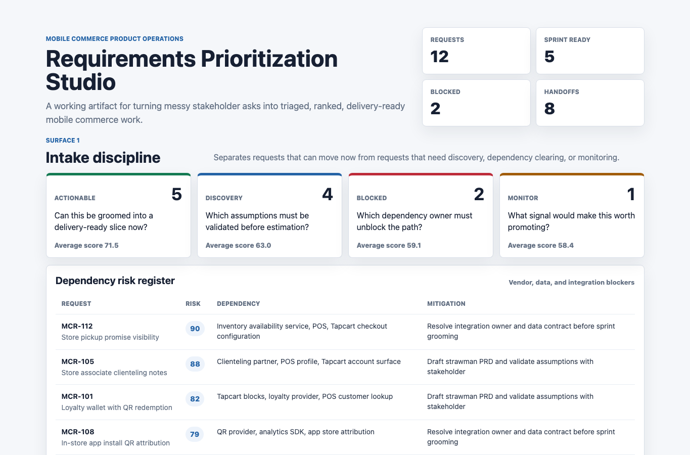
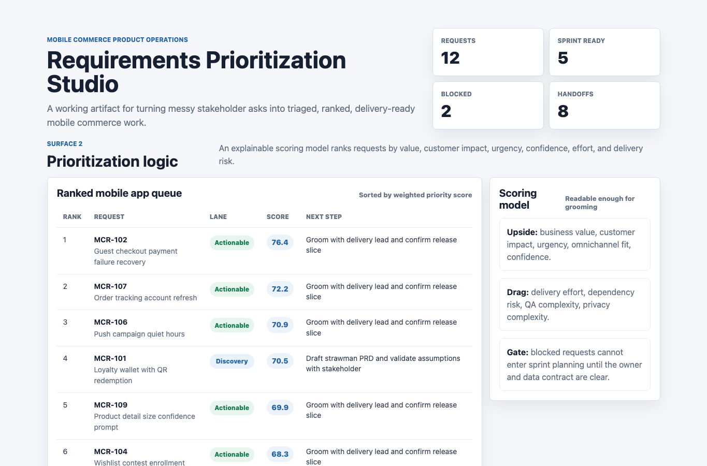
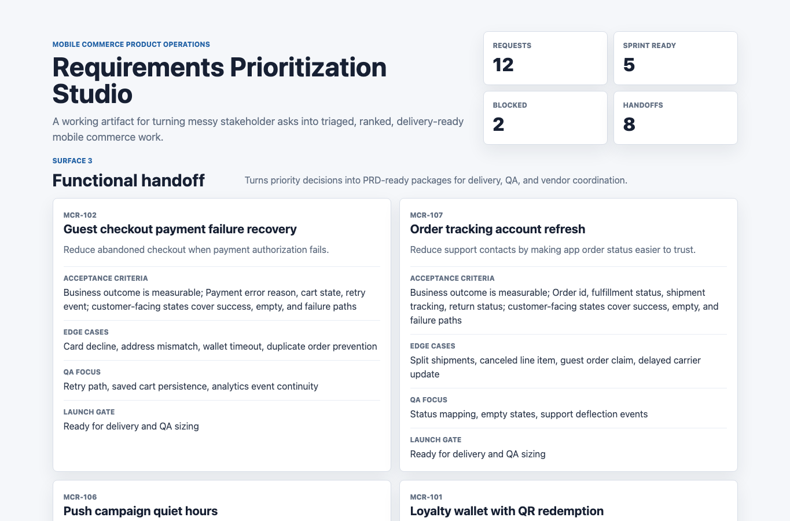

# Mobile Commerce Requirements Prioritization Studio

A portfolio artifact for a retail mobile commerce product analyst role. The studio shows how ambiguous app, ecommerce, loyalty, personalization, QR, POS, and clienteling requests can move from stakeholder intake to prioritization and delivery handoff.

The artifact is intentionally not just a dashboard. It is a requirements operating system with an explainable scoring model, intake lanes, dependency risk tracking, and PRD-style handoff packages.

## Screenshots



**Intake triage:** Separates actionable work from discovery, blocked, and monitor requests. It also surfaces vendor, data, and integration blockers before they reach sprint planning.



**Prioritization logic:** Ranks mobile commerce requests with a readable scoring model that balances business value, customer impact, urgency, omnichannel fit, confidence, effort, dependency risk, QA complexity, and privacy complexity.



**Functional handoff:** Converts the highest priority requests into PRD-ready packages with problem statements, acceptance criteria, edge cases, QA focus, vendor dependencies, and launch gates.

## What This Project Demonstrates

- Intake ownership for mobile app and ecommerce enhancements.
- Requirements architecture for messy or incomplete stakeholder asks.
- Mobile commerce prioritization across checkout, loyalty, personalization, messaging, product detail, account, post purchase, fulfillment, and omnichannel workflows.
- Vendor and integration coordination for Tapcart-style mobile app work.
- Functional handoff discipline for delivery and QA teams.
- Strategic translation between business goals, technical constraints, and release sequencing.

## Data

All data is synthetic and labeled as synthetic. It does not represent real company performance, customer behavior, or internal systems.

The dataset is modeled on common retail mobile commerce operating structures:

- `data/mobile_requests.csv` contains 12 request records with stakeholder, platform area, intake lane, value, risk, confidence, readiness, vendor dependency, data dependency, edge cases, and QA focus.
- `analysis/outputs/priority_queue.csv` is generated by `scripts/score_operating_data.py` and powers the ranked queue.
- `analysis/outputs/intake_triage_summary.csv` summarizes request counts and operating questions by lane.
- `analysis/outputs/integration_risk_register.csv` identifies the highest dependency risks.
- `analysis/outputs/handoff_packages.csv` creates PRD-style handoff packages for the top requests.

Synthetic scores use 0 to 100 scales for business value, customer impact, urgency, delivery effort, dependency risk, QA complexity, privacy complexity, confidence, omnichannel fit, and acceptance readiness. The request set is shaped around realistic mobile commerce scenarios such as checkout recovery, loyalty wallet redemption, product detail fit confidence, app install QR attribution, store pickup promise visibility, and order tracking.

## Scoring Model

The model is intentionally explainable:

```text
upside = business value + customer impact + urgency + omnichannel fit + confidence
drag = delivery effort + dependency risk + QA complexity + privacy complexity
priority score = bounded weighted upside minus weighted drag
```

Blocked requests can still score well strategically, but they do not become sprint-ready until the dependency owner and data contract are clear.

## Scope

This artifact does:

- Generate synthetic product operations data.
- Rank a mobile commerce backlog with an explainable model.
- Show distinct intake, prioritization, and handoff surfaces.
- Document assumptions so the project can be defended in an interview.

This artifact does not:

- Use real company data.
- Connect to a live Tapcart, POS, loyalty, CRM, order management, analytics, or payment system.
- Claim production launch impact.

## Run Locally

```bash
python3 scripts/score_operating_data.py
python3 -m http.server 4173
```

Then open `http://localhost:4173`.
